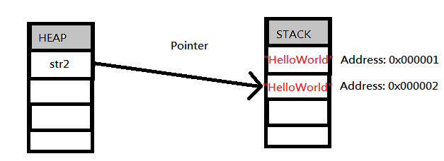

# 前言：Java String在RAM的存活方式

GitBook Space URL :　

　　不管開發Android App還是Java應用程式，String是我們必定會用到的Object。既可儲存文字資料，也可以使用它給予使用者訊息等等。但你有沒有想過，這個常用的Object會不會有開發上的性能問題呢？以下將會詳細的探討。

有開發Java或者是Android，我們已經知道String這個Object是可以用以下兩種方式，進行實體化：

```text
//第一種
String str1 = "HelloWorld";

//第二種
String str1 = new String("HelloWorld");
```

但有沒有想過他們在記憶體是怎麼存活的呢？

我們先進行第一種分析，也是開發最常用的方式。當建立str1時候，直接指派到某一個字符串上，它的生存方式是：


第一種方式很簡單，基本上都看得懂吧，Stack在0x000001位置放入"HelloWorld"資料，並且str1的pointer指向0x000001位置。

接下來分析第二種：



有沒有發現到，當使用第二種的實體化，記憶體中的Stack產生了兩個"HelloWorld"？  
這邊來解釋一下過程：  
第一步：String str2 = new String\("HelloWorld"\); 當這句語法執行後，str2在Heap被建立，並且指派到Stack位置0x000001，這時候0x000001的值是空的。  
第二步：但由於我們使用的new String\("HelloWorld"\)是包含著"HelloWorld"內容，因此0x000001就開始被賦予"HelloWorld"這個值。  
第三步：可是String這時候會認為這是兩個動作，1.建立實體後，2.賦予值，所以str2將會指派到新的0x000002上，內容也同時指派"HelloWorld"．而0x000001將會等待System.gc\(\)回收資源。

　　由於可見，使用new String\("Content"\)不但沒有很好的節省記憶體空間，當String賦予新的值，還要Pointer花時間去指向新的記憶體位置......等等！  
［不但沒有很好的節省記憶體空間，當String賦予新的值，還要Pointer花時間去指向新的記憶體位置］？

以上這句話再舉個例子好了，我們再從str2使用的狀況下延伸下去：

```text
String str2 = new String("HelloWorld");
str2 = "This is ";
str2 += "an Apple";
```


然後記憶體狀況就變成如下：

　　有看到了嗎？Address: 0x000001 ~ 0x000005都有被使用過了！0x000005是目前使用的記憶體空間了，那0x000001~0x000004怎麼辦了？當然是等待System.gc\(\)回收囉，上面的例子，就連第一種的使用方式，也會出現這個問題。

　　試想一下，一直叫系統回收你的資源，回收動就不需要耗費CPU效能？要馬兒不吃草，又要馬兒好？那如果開發Android App，有20個TextView或者String Object要每分鐘更新一次的話，你真的想給系統每小時多回收1200+個垃圾？

　　其實可以使用StringBuffer或者StringBuilder，可以只使用一個Address，又不用改變Pointer的指向情況下，進行字串的改變。


　　因此String的源頭減廢，由StringBuffer以及StringBuilder做起！後面將會舉個實例，關於頻繁操作Pointer耗費的CPU效能影響。

