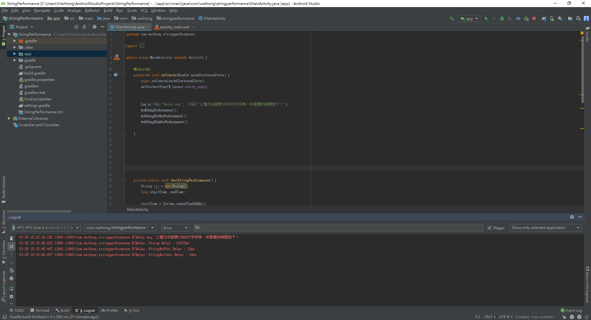

# 正文：String、StringBuffer、StringBuilder效能比較

講這個比較前，容許我先上個結果圖，比較好理解後面的解說。

上圖的Log結果是：


三種方式變更10000次字符串，所需要的時間如下：  
String Delay : 16333ms   
StringBuffer Delay : 12ms   
StringBuilder Delay : 10ms




以上範例是String、StringBuffer以及StringBuilder三者，在hTC One X同一個程序下各做了1萬次字串的改變，可以得知String耗時16333ms，相當於16.333秒。StringBuffer耗時12ms，相當於0.012秒。StringBuilder耗時10ms，相當於0.01秒。應該不用多說吧，使用StringBuffer或者StringBuilder處理字串的速度，String短時間處理了１萬次的Pointer轉換，而StringBuffer以及StringBuilder只處理了１次Pointer轉換，效率差了快一千多倍！

　　當然，並不是說String的作用毫無用處，因為String的處理字串的方式非常多樣化，而StringBuffer以及StringBuilder就沒那麼精彩了，有遇到字串的特殊化格式需要，還是需要String來協助的，因此開發的時候該用String、StringBuffer還是StringBuilder，還是以當前環境來作決定的！

　　說了這麼多，一定還有個疑問StringBuffer跟StringBuilder的區別，其實兩者功能大致上是相同的，唯一不同的特點是StringBuilder在主線程處理字串的速度優化更好，在上述例子可以看得出，StringBuilder的速度是10ms，比起StringBuffer速度快了2ms。而StringBuffer在處理執行緒\(子線程\)上的字串較為安全，避免字串在非同步線程產生的未知錯誤。

　　這樣一來，以後開發就需要注意String的使用情況了，按照需求適當的運用StringBuffer或者StringBuilder，可以讓Android App或者Java程序可以減少大量的資源回收機制操作。

